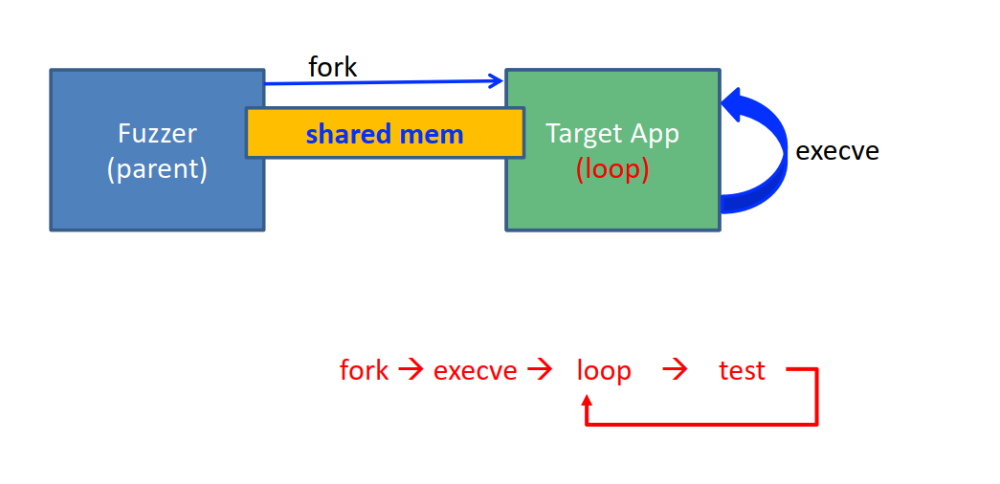

# Week 5
## 链接
- AFL
	- [google/AFL: american fuzzy lop - a security-oriented fuzzer (github.com)](https://github.com/google/AFL)
	- [AFL 源码分析（一）从 0 到 1 再到 n - Stay Hungry (xidoo.top)](https://xidoo.top/2022/01/afl-rsc/)
	- [AFL内部实现细节小记 - 记事本 (rk700.github.io)](https://rk700.github.io/2017/12/28/afl-internals/)
- AFL++ & LibAFL
	- [AFLplusplus/AFLplusplus: The fuzzer afl++ is afl with community patches, qemu 5.1 upgrade, collision-free coverage, enhanced laf-intel & redqueen, AFLfast++ power schedules, MOpt mutators, unicorn_mode, and a lot more! (github.com)](https://github.com/AFLplusplus/AFLplusplus)
	- [The LibAFL Fuzzing Library - The LibAFL Fuzzing Library (aflplus.plus)](https://aflplus.plus/libafl-book/libafl.html)
- Fuzzing 101
	- [antonio-morales/Fuzzing101: An step by step fuzzing tutorial. A GitHub Security Lab initiative](https://github.com/antonio-morales/Fuzzing101/tree/main)
	- [Fuzzing101 with LibAFL - Part I: Fuzzing Xpdf (epi052.gitlab.io)](https://epi052.gitlab.io/notes-to-self/blog/2021-11-01-fuzzing-101-with-libafl/)
## AFL
### 工作模式
#### Dumb Mode

#### Fork Server

#### Persistent Mode

## LibAFL 
### Core Concepts

trait + implementation
fuzzer = composition of components
- Data (before running):
	- `Input`: the internal representation of the program input, e.g. byte arrays, AST, token-level...
	- `Testcase`: `Input` + metadata.
	- `Corpus`: where testcases are stored.
	- `State`: all the metadata that are evolved while running the fuzzer
- Run:
	- `Scheduler`: how the fuzzer requests a `Testcase` from `Corpus`.
	- `Observer`: provides an **information** observed during the execution of the program under test to the fuzzer.
	- `Feedback`: classifies the outcome of an execution of the program under test as **interesting** or not.
	- `Objective`: feedback, but "interesting" = **hit**. In other words, interesting `Objectives` won't be mutated further, and are counted as **solutions**, a successful fuzzing campaign.
	- `Executor`: defines not only how to **execute** the target, but all the volatile **operations** that are related to just a single run of the target.
- Working on data (after runnning):
	- `Mutator`:  takes one or more `Inputs` and generates a new instance of `Input` derived by its inputs.
	- `Generator`: generate an `Input` from scratch.
	- `Stage`: operates on a single `Input` received from the `Corpus`.
### Examples
- baby_fuzzer: basic components of a fuzzer
- baby_no_std: 源码基本一致，因为 LibAFL 大多只使用 `core`
- forkserver_libafl_cc: use `libafl-cc` (clang wrapper in LibAFL) for instrumentation
- forkserver_simple: use `afl-cc` (from AFL++) for instrumentation
### Fuzzing 101 with LibAFL
#### Setup
- llvm: AFL++ and LibAFL 都有要求，15/16 较好
- 编译 AFL++ 的一些组件需要比较新的 pip（python 3.8 配套疑似不行）
#### Part 1: xpdf
- Corpus
- Target
	- `build.rs` for auto building
- Fuzzer
	- Components:
		- Observer, Feedback, State
			- Shared memory for **coverage map**
		- Monitor, Event Manager
		- Scheduler
		- Fuzzer
		- Executor
		- Mutator, Stage
#### Part 1.5: Speed improvements
##### Compiler
- `afl-clang-fast` -> `afl-clang-lto`, 10% faster
- better coverage for AFL
- autodictionary: a dictionary generated during compiling and transfered to afl-fuzz on start; improves coverage statistically by 5-10%
##### Shared memory for data transition
- Shared memory for **data transition** from forkserver to target app, no disk I/O, 2x/3x faster
- AFL init
- Refactor part of target app to add init code
	- Can also remove unnecessary parts that you don't care (e.g., command line parsing, validation)
- Note: this is still **forkserver**!
##### Executor
- `ForkserverExecutor` -> `InProcessExecutor`, forkserver -> persistent mode, **10x faster**
- How? You'll need...
	- Statically compiled app (harness)
	- Statically compiled lib (fuzzer)
	- Link them together!
- Harness/Fuzz target
	- Takes inputs as parameters, and uses them to call the target lib
	- With LibAFL and libFuzzer-style interface:
		- harness (`harness.cc`): `extern "C" int LLVMFuzzerTestOneInput(const uint8_t *data, size_t size)`
		- fuzzer (`lib.rs`): `fn libafl_targets::libfuzzer_test_one_input(buf: &[u8]) -> i32`
	- Requirements: (taken from [libFuzzer docs](https://llvm.org/docs/LibFuzzer.html#fuzz-target))
		> - The fuzzing engine will execute the fuzz target many times with different inputs in the same process.
		> - It must tolerate any kind of input (empty, huge, malformed, etc).
		> - It **must not `exit()`** on any input. (Note by myself: you can use `abort()` instead)
		> - It may use threads but ideally all threads should be joined at the end of the function.
		> - It must be as **deterministic** as possible. Non-determinism (e.g. random decisions not based on the input bytes) will make fuzzing inefficient.
		> - It must be **fast**. Try avoiding cubic or greater complexity, logging, or excessive memory consumption.
		> - Ideally, it should not modify any global state (although that’s not strict).
		> - Usually, the **narrower** the target the better. E.g. if your target can parse several data formats, split it into several targets, one per format.
- Fuzzer
	- Coverage map:
		- before: create shared memory for coverage map, registered with  `__AFL_SHM_ID` for `afl-clang-fast` to find it.
		- now: use `clang` with [SanitizerCoverage](https://clang.llvm.org/docs/SanitizerCoverage.html#introduction) enabled, taking down coverage information with some *user-defined functions*
			- use `libafl_cc::ClangWrapper`
			- `libafl_targets::coverage::EDGES_MAP` (`__afl_area_ptr_local`) will be the map
			- *user-defined functions* are implemented in `libafl_targets::sancov_pcguard`
	- Components to update
		- Observer: use `libafl_targets::std_edges_map_observer` to create a `StdMapObserver` which holds `EDGES_MAP`
		- Monitor: splits outputs of target and fuzzer in different terminals
		- Event manager: restarts when crashed, keeps fuzzing going
- Compiler wrapper
	- Enable SanCov
	- Pass arguments to compiler (e.g. files to link)
	- Link target and fuzzer
- Use `cargo-make` to build things!
- Notes on [`libafl_targets`](https://docs.rs/libafl_targets/0.11.2/libafl_targets/index.html): contains runtime code, injected in the target itself during compilation
	- Don't forget to enable used **features**!
	- [`sancov_pcguard`](https://docs.rs/libafl_targets/0.11.2/libafl_targets/sancov_pcguard/index.html): impl functions used by [LLVM PcGuard](https://clang.llvm.org/docs/SanitizerCoverage.html#tracing-pcs-with-guards)
	- [`libfuzzer`](https://docs.rs/libafl_targets/0.11.2/libafl_targets/libfuzzer/index.html): [Libfuzzer](https://www.llvm.org/docs/LibFuzzer.html)-style runtime wrapper for LibAFL
		- [libfuzzer_test_one_input](https://docs.rs/libafl_targets/0.11.2/libafl_targets/libfuzzer/fn.libfuzzer_test_one_input.html): wrapper for calling `LLVMFuzzerTestOneInput()`
	- [`coverage`](https://docs.rs/libafl_targets/0.11.2/libafl_targets/coverage/index.html): coverage maps used in AFL