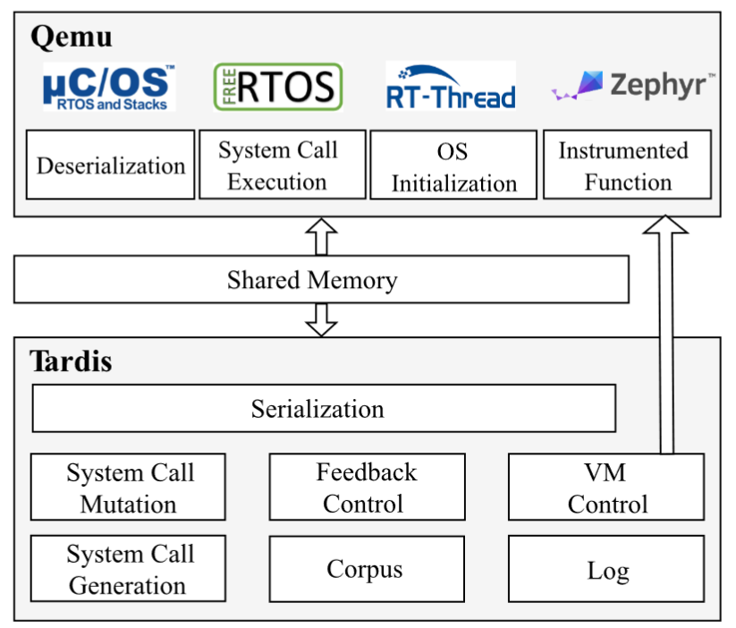

# Week 9

## Fix the fuzzer

- 使用 Qemu 原生 snapshot 效率太低，甚至没法通过手动构造的 bug 验证 fuzzer 的正确性

  以 baby_fuzzer 中的 harness 为例，在不同的插桩方式下，找到 bug 所需时间：

  - static instrumentation: << 1s
  - qemu user mode: < 10s
  - qemu system mode (breakpoint, fast snapshot): < 10s

  实际上所需执行次数基本都在 10^4 量级，所以执行速度直接决定了 fuzzing 的效率。

- 重新分析 fast snapshot 崩溃的原因

  - 通过 print 输出得到的现象：总是在第二次运行崩溃

    ```
    Devices = [...]
    !!!Start emulator loop
    !!!Start: current CPU is null
    !!!Loop once
    SeaBIOS (version rel-1.16.3-0-ga6ed6b701f0a-prebuilt.qemu.org)
    Booting from Hard Disk..xv6...
    acpi: cpu#0 apicid 0
    acpi: ioapic#0 @fec00000 id=0 base=0
    
    cpu0: starting xv6
    
    cpu0: starting
    init: starting harness
    !!!Exit from sync backdoor
    !!!After run: current CPU is normal
    !!!Handle sync backdoor exit: Start fuzzing with input @vaddr 0x9a0
    !!!Save snapshot: start command
    !!!Loop once
    !!!Input command: current cpu is normal
    !!!Input command write return reg
    !!!Exit from sync backdoor
    !!!After run: current CPU is normal
    !!!Handle sync backdoor exit: Exit of kind Some(Ok)
    !!!Restore snapshot: end command
    !!!Restore devices
    !!!Restore dirty RAM blocks
    !!!Restore done
    [UserStats   #1]  (GLOBAL) run time: 0h-0m-0s, clients: 1, corpus: 0, objectives: 0, executions: 0, exec/sec: 0.000, edges: 99.644%
                      (CLIENT) corpus: 0, objectives: 0, executions: 0, exec/sec: 0.000, edges: 2242/2250 (99%)
    -----------------------
    !!!Start emulator loop
    !!!Start: current CPU is normal
    !!!Loop once
    !!!Input command: current cpu is normal
    !!!Input command write return reg
    pid 2 harness: trap 14 err 4 on cpu 0 eip 0xffffffff addr 0xffffffff--kill proc
    [Testcase    #1]  (GLOBAL) run time: 0h-0m-0s, clients: 1, corpus: 1, objectives: 0, executions: 1, exec/sec: 0.000, edges: 99.644%
                      (CLIENT) corpus: 1, objectives: 0, executions: 1, exec/sec: 0.000, edges: 2242/2250 (99%)
    !!!After run: current CPU is null, exit_reason: Err(UnexpectedExit)
    !!!Restore snapshot: unexpected exit
    !!!Restore devices
    !!!Restore dirty RAM blocks
    !!!Restore done
    We imported 1 inputs from disk.
    -----------------------
    !!!Start emulator loop
    !!!Start: current CPU is null
    !!!Loop once
    !!!Input command: current cpu is none
    !!!Input command write return reg
    [Objective   #1]  (GLOBAL) run time: 0h-0m-3s, clients: 1, corpus: 1, objectives: 1, executions: 2, exec/sec: 0.665, edges: 99.644%
                      (CLIENT) corpus: 1, objectives: 1, executions: 2, exec/sec: 0.665, edges: 2242/2250 (99%)
    [Objective   #1]  (GLOBAL) run time: 0h-0m-3s, clients: 1, corpus: 1, objectives: 2, executions: 3, exec/sec: 0.969, edges: 99.644%
                      (CLIENT) corpus: 1, objectives: 2, executions: 3, exec/sec: 0.969, edges: 2242/2250 (99%)
    ```

  - 观察到奇怪的现象：只要 harness 中存在 `printf` 或 `write` 调用即可正常运行，否则就会在第二次运行时出现异常

## On kernel fuzzing

- 在更简单的系统上完成 fuzzing，如嵌入式系统？

  - 简单了解了 FreeRTOS 的架构：[FreeRTOS Features - FreeRTOS](https://www.freertos.org/features.html)
  - 基本概念

- 如何适配具体的 OS ？复习 Tardis

  - harness 也是一个用户态的程序，负责 initialization, testcase deserialization, system call execution 等

  - 使用 system call description 来适配不同 OS，应该类似于 [syzcaller](https://github.com/google/syzkaller/blob/master/docs/syscall_descriptions.md)，但没有拿到相关代码

  - 架构示意图

    

## 计划

- kernel fuzzing?